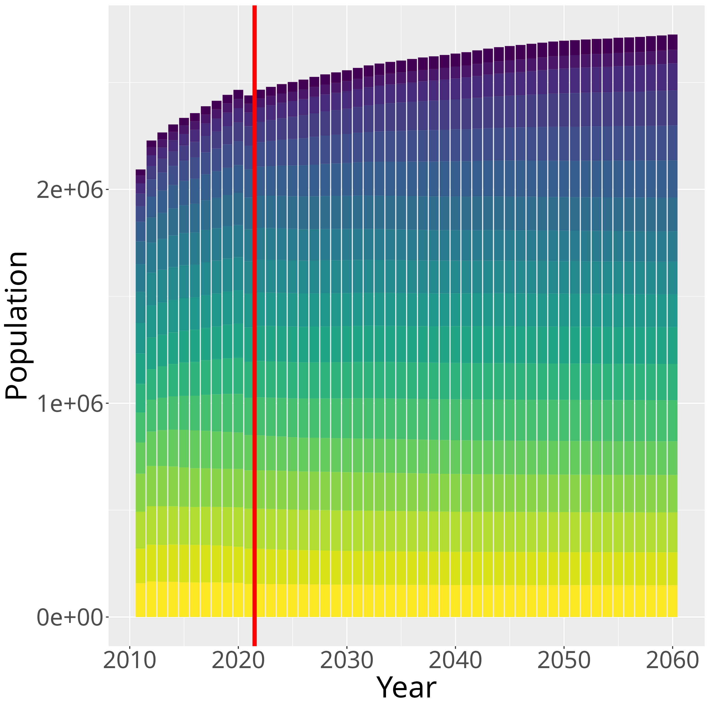

# Population Projection Model with Census Data
This is a code repository for my Master's project at the California State University at San Bernardino. The project is to develp method to build population projection model with the Census population data. The models were trained in 2 variations, Random Forest (statistical machine learning model), and RWKV (deep neural network model). Projections are generated for each 5 year divided age binned population of each place, resulting in projection of age group population flow in each places. Technique of conformalized quatnile regression is applied to the models to generate prediction intervals for the projections.

Link to the project report: https://scholarworks.lib.csusb.edu/etd/1803/

## Code
The project code is formed with sereis of R and Python scripts, separted into each stage of process. Abstruct explanation of each stage/script is as follows:

### Data Collection: data_collection.R
R script collects population data from census. For use, <strong>CENSUS_KEY environment variable in the code must be replaced with your own census API key</strong>. The script will collect population data from ACS5, from 2010 to 2021, subject tables S0101 S0701 S1301, every place in US, then separates data of places in Riverside County in California (test data), stores csv files in data folder.

### Data Analysis: data_analysis.R
R script which generates 3 vislualization plot of total population of whoel US by summing all the placed in collected data, and the plots will be stored in plots folder as png files.

#### Sample Plots

### Data Clustering and Splitting: data_cluster_split.R tsne_plots.R
R script which clusters the collected data by K-means clustering with Soft DTW distance, and splits the data into training and validation data for each cluster. All the information about clustering and splitting will be stored in addiiotnal columns of data frame, will be stored as RDS file in data folder. Another R script tsne_plots.R will generate t-SNE plots of the data, and will be stored in plots folder as png files.

#### Sample Plots

### Data Engineering: data_processing.R ema_augmentation.R
R script data_processing.R which process through data wrangling and normalization, store data as prepped data in data folder. Another R script ema_augmentation.R which augments the data with exponential moving average, and store the data as prepped data in data folder. 

### Model Training: train_random_forest.R train_rwkv.py
R script train_random_forest.R which trains Random Forest model with the prepped data, and store the model as RDS file in models folder. Python script train_rwkv.py which trains RWKV model with the prepped data, and store the model in models folder.

### Generate Projections: project_random_forest.R project_rwkv.R
R scripts generate projections with the trained models, and store the projections as RDS files in data folder.

### Visualization: visualize.R
R script generate visualizations of the projections, and store the visualizations as png files in plots folder. 

#### Sample Plots
Generated projections for Whole Riverside County (total of all places in Riverside County)Left: Random Forest, Right: RWKV
 

 
Age Group Projections for Whole Riverside CountyLeft: Random Forest, Right: RWKV
 

 
Total Population Quantile Projections for Whole Riverside County
 

 
Working to Senior Age Group Ratio Quantile Projections for Whole Riverside County
 

### Evaluation: evaluate.R
R script evaluate the projections with the test data, and store the evaluation results as RDS files in data folder.
